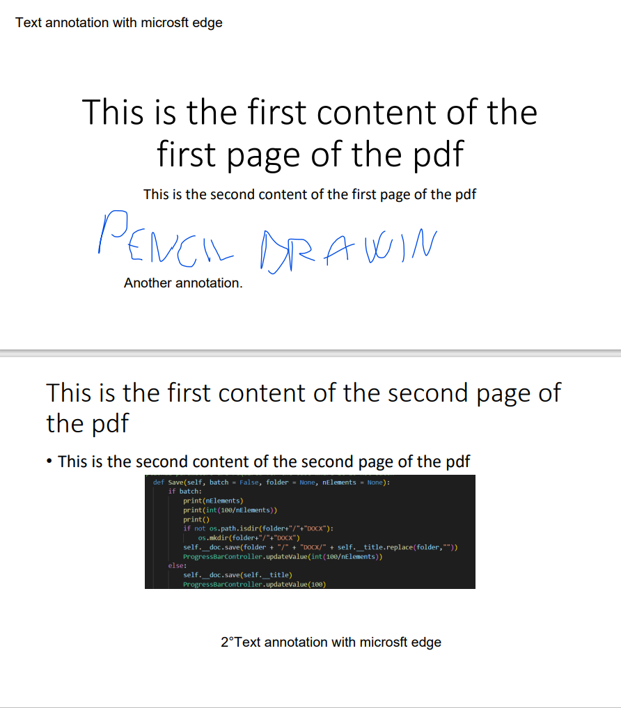
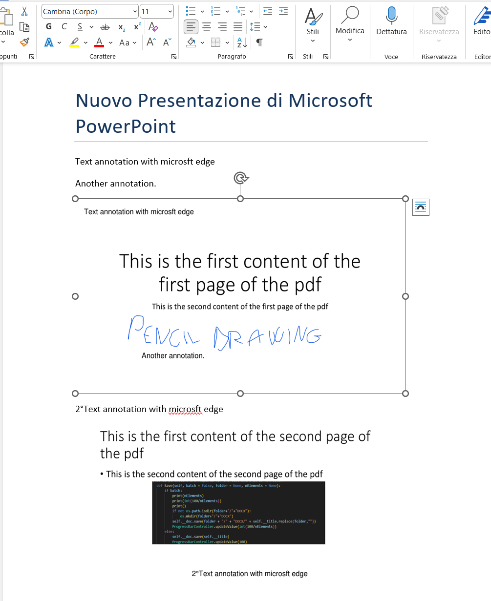

# PDF TO WORD CONVERTER
## Overview
The goal of this software is to convert pdf files into docx files where:

 - Notes on the pdf (taken with normal software such as Adobe Acrobat,
   Edge etc.) are converted into editable text in word. 
- The pdf page becomes an image in word.

The final result is then an editable docx file where for each page of the pdf there will be a docx page with the annotations in text format and a screenshot of the pdf page they were on.
The image below shows just the final result.

